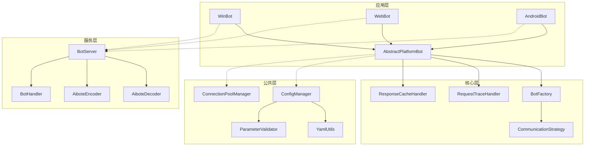

# 架构设计参考

本章提供了 Aibote4J 框架架构设计的详细参考资料。

## 系统架构图



## 模块依赖关系

### sdk-common 模块
- **功能**: 公共工具和配置管理
- **主要组件**:
  - 配置管理 (ConfigManager)
  - 参数验证 (ParameterValidator)
  - YAML 工具 (YamlUtils)
  - 基础工具类

### sdk-core 模块
- **功能**: 核心机器人功能
- **主要组件**:
  - 抽象机器人基类 (AbstractPlatformBot)
  - 机器人工厂 (BotFactory)
  - 通信策略 (CommunicationStrategy)
  - 异常处理体系

### sdk-server 模块
- **功能**: 服务端实现
- **主要组件**:
  - 服务器实现 (BotServer)
  - 编解码器 (AiboteDecoder/AiboteEncoder)
  - 请求处理器 (BotHandler)
  - 客户端管理 (ClientManager)

## API 接口规范

### 机器人接口
所有机器人必须实现的标准接口：

```java
public abstract class AbstractPlatformBot {
    public abstract boolean connect();
    public abstract void disconnect();
    public abstract String getScriptName();
    public void sleep(int milliseconds);
    public static String getVersion();
}
```

### 通信协议
- **请求格式**: `长度/长度/.../数据`
- **响应格式**: 根据命令类型变化
- **编码**: UTF-8
- **传输**: TCP/IP

## 设计模式应用

### 工厂模式
- **应用位置**: BotFactory
- **作用**: 统一创建不同类型的机器人实例
- **优势**: 解耦创建逻辑，易于扩展

### 模板方法模式
- **应用位置**: AbstractPlatformBot
- **作用**: 定义算法骨架，子类实现具体步骤
- **优势**: 代码复用，统一管理

### 单例模式
- **应用位置**: ConfigManager, RequestTraceHandler, ResponseCacheHandler
- **作用**: 全局唯一实例
- **优势**: 节省内存，统一管理状态

### 策略模式
- **应用位置**: CommunicationStrategy
- **作用**: 支持不同的通信协议实现
- **优势**: 易于扩展，灵活切换

## 性能指标

### 响应时间
- **正常操作**: < 100ms
- **复杂操作**: < 1000ms
- **网络操作**: < 5000ms

### 并发能力
- **默认连接池**: 10 个连接
- **最大并发数**: 100
- **线程池大小**: 10

### 资源使用
- **内存占用**: < 512MB (基础使用)
- **CPU 使用率**: < 20% (空闲状态)

## 配置参数

### 通信配置
```yaml
communication:
  responseTimeout: 2000          # 响应超时时间
  delayResponseTimeout: 6000     # 延迟响应超时
  retryTimes: 3                  # 重试次数
  retryInterval: 500             # 重试间隔
  connectionPoolSize: 10         # 连接池大小
```

### 性能配置
```yaml
performance:
  maxConcurrency: 100            # 最大并发数
  threadPoolSize: 10             # 线程池大小
```

### 安全配置
```yaml
security:
  enableValidation: true         # 启用参数验证
```

## 扩展接口

### 自定义通信策略
实现 [CommunicationStrategy](file:///F:/workspace/github/aibote4j/sdk-core/src/main/java/net/aibote/sdk/strategy/CommunicationStrategy.java) 接口扩展通信协议：

```java
public class CustomStrategy implements CommunicationStrategy {
    @Override
    public void sendCommand(ChannelHandlerContext ctx, String command, String... params) {
        // 自定义命令发送逻辑
    }
    
    @Override
    public void sendBytes(ChannelHandlerContext ctx, byte[] data) {
        // 自定义字节发送逻辑
    }
    
    @Override
    public Object handleResponse(byte[] response) {
        // 自定义响应处理逻辑
        return response;
    }
}
```

### 自定义缓存策略
扩展 [ResponseCacheHandler](file:///F:/workspace/github/aibote4j/sdk-core/src/main/java/net/aibote/sdk/handler/ResponseCacheHandler.java) 实现自定义缓存：

```java
public class CustomCacheHandler extends ResponseCacheHandler {
    @Override
    protected void performCleanup() {
        // 自定义清理逻辑
    }
}
```

## 安全考虑

### 输入验证
- SQL 注入防护
- XSS 攻击防护
- 格式验证
- 长度限制

### 访问控制
- 连接认证
- 权限检查
- 操作审计

### 数据保护
- 敏感信息加密
- 传输加密
- 日志脱敏

## 监控指标

### 性能指标
- 请求响应时间
- 错误率
- 并发连接数
- 内存使用率

### 业务指标
- 成功操作数
- 失败操作数
- 缓存命中率
- 连接池使用率